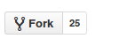

# Contributing

If you want to contribute to this book, please follow these simple rules:

1. Press the fork button:

    

2. Clone the repository from your account with:

    ```
    git clone git@github.com:your_github_username/virtuosodba.git
    ```

3. Create a new branch with:

    ```
    git checkout -b "my-changes'
    ```

    You can name it however you want.

4. Make your changes.

5. Don't forget to add yourself in [contributors.md].

6. Commit and push your changes, then make a pull request from Github.

**IMPORTANT**

Please, don't forget to update your fork. While you made your changes, the content of the `master` branch can change because other pull requests were merged and it can create conflicts. This is why you have to rebase on `master` every time before pushing your changes and check that your branch doesn't have any conflicts with `master`.

Thank you.
